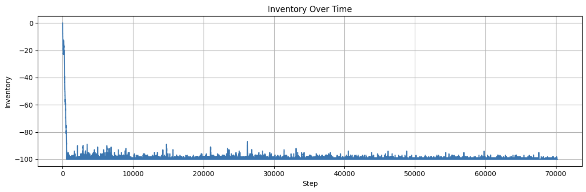

# Algorithmic Trading System with Reinforcement Learning
<a name="abstract"></a>

## Abstract

This paper introduces a **modular reinforcement-learning pipeline for algorithmic trading** that couples a realistic limit-order-book environment (*LOBEnv*) with a dual-LSTM Proximal Policy Optimization (PPO) agent. *LOBEnv* reproduces bid–ask dynamics, execution latency, and market impact, enabling training under conditions that mirror live trading. Our *StateBuilder* condenses raw market data into a 17-feature vector capturing essential price and liquidity information.

A core contribution is the **Generalized Return-Potential-Opportunity (GRPO) reward function**, which balances profit, risk exposure, opportunity cost, and execution quality to foster resilient trading behavior and lays groundwork for longer-horizon AGI-driven strategy discovery. The agent architecture employs separate LSTM stacks for actor and critic components, enabling effective identification of temporal patterns in financial data.

The system's highly modular design allows researchers to swap any component without affecting the rest of the pipeline, facilitating rapid experimentation. The prototype has been designed for single-day Apple LOB data, with ongoing work to scale to a 30-day, 100-symbol corpus. Comprehensive evaluation tools will analyze P&L, inventory trajectories, and state-space clustering to determine whether the agent rediscovers known trading tactics or hints at novel strategies.


<a name="intro"></a>
## 1 Introduction
<a name="what-is-trading"></a>
### 1.1 What is Trading?

Trading in financial markets involves the buying and selling of financial instruments such as stocks, bonds, currencies, and derivatives with the goal of generating a profit from changes in their prices. Traders aim to buy assets at a lower price and sell them at a higher price, or in some cases, sell assets at high prices and later repurchase them at lower prices (short selling).

Modern trading is heavily influenced by technological advancements, with algorithms handling a significant portion of all trading activity in major markets. These algorithms can process market data, detect patterns, and execute trades at speeds and volumes impossible for human traders.

#### Historical context

The evolution of trading has seen several transformative phases:

1. **Traditional to Early Electronic Trading (Pre-2000)**: Starting with traders physically gathered on exchange floors using hand signals, the industry evolved to electronic communication networks that allowed remote execution and increased market access.

2. **Algorithmic & High-Frequency Trading (2000s-2010s)**: The development of rule-based algorithms enabled automated execution, eventually advancing to microsecond and nanosecond timescales with specialized hardware and low-latency connections providing competitive advantages.

These milestones motivate our modular RL pipeline that learns to act at micro- to millisecond scale.

The remainder of this report shows how a modular RL pipeline can discover and evaluate such strategies.

<a name="related-concepts"></a>
### 1.2 Related Concepts

#### LOBEnv (Limit Order Book Environment)
Our custom simulation environment that reproduces order-book microstructure. Provides a training ground that mirrors live trading conditions.

#### StateBuilder
Component that transforms raw market data into a compact 17-feature vector representation. Captures essential price movements, liquidity indicators, and temporal context for agent decision-making.

#### Reinforcement Learning for Trading
Our implementation where agents learn trading strategies through market interaction. Addresses challenges of non-stationarity and partial observability through custom environment design.

#### Proximal Policy Optimization (PPO)
Algorithm offering sample-efficient, stable updates via trust-region clipping. Prevents destructive jumps in high-variance market data.

#### Dual-LSTM Architecture
Neural network design using separate LSTM stacks for actor and critic components. Identifies multi-horizon temporal patterns in LOB data for effective trading decisions.

#### Generalized Return-Potential-Opportunity (GRPO) Reward
Novel reward system balancing immediate returns with future opportunities. Combines realized P&L, inventory risk, opportunity cost, and execution quality metrics for adaptive trading.

<a name="objectives"></a>
## 2 Objectives

Our project creates a modular pipeline that enables rapid experimentation by decoupling environment, agent, and reward components.

Key objectives:

* **Develop an RL trading agent** using LSTM networks for time-series modeling and policy optimization for intelligent action selection in complex market environments.

* **Create a sophisticated reward framework** incorporating market signals like spread and volume imbalance while implementing essential risk constraints to guide agent behavior.

* **Design a modular pipeline architecture** allowing researchers to develop, test, and swap components independently without affecting the rest of the system.

* **Implement realistic market simulation** with bid-ask dynamics and execution mechanics to train agents under conditions that mirror live trading.

* **Explore strategy rediscovery vs. novel development** to assess AI's market understanding and evaluate potential for alpha generation beyond known trading tactics.


<a name="prototype"></a>
## 3 Prototype: 1-Day / 1-Symbol POC

<a name="proto-arch"></a>
### 3.1 System Architecture (Prototype)

Our 1-day prototype implements a modular reinforcement learning pipeline for algorithmic trading that consists of six primary components working together in a flexible, plug-and-play architecture. The system architecture enables independent development and testing of each module while maintaining compatibility through standardized interfaces.


The prototype system includes the following key components:

1. **Environment (`LOBEnv`)** – Gymnasium-compatible limit-order-book simulator that replays historical ticks, executes orders, and returns P&L.

2. **StateBuilder** – Condenses raw packets into a 17-feature vector of prices, depth, imbalance, and time cues.

3. **FillsLedger** – FIFO trade ledger that tracks inventory and computes realized / unrealized P&L.

4. **Reward** – Baseline PnL + inventory penalty (full specification in § 3.3).

5. **Agent** – Dual-LSTM PPO policy that maps features → {buy, sell, hold}.

6. **Evaluation** – Dashboards and metrics for P&L, risk, and behaviour diagnostics.

The system's data flow follows a logical sequence: StateBuilder processes raw data into feature vectors, the agent takes actions based on these features, LOBEnv simulates order execution, FillsLedger tracks trades, and the reward function provides feedback for learning. This modular architecture enables experimentation with different components without affecting the rest of the pipeline.

<a name="proto-dev"></a>
### 3.2 Development Process

The development of our 1-day prototype followed a systematic approach to build a complete reinforcement learning pipeline for algorithmic trading. We progressed through several interconnected stages to move from raw market data to a fully trained agent.

#### Data Acquisition
Our process began with data acquisition and processing. We developed a parser (`parse_iex_deep.py`) to extract limit order book data from PCAP files, filtering specifically for our target symbol (AAPL) and downsampling to 100ms bins to balance granularity with computational efficiency.

#### Feature Engineering
We transformed raw market data into an enriched feature set including level-1 order book data, derived metrics like mid-price and spread, momentum indicators, and temporal features. Critical preprocessing steps included removing pre-market data, normalizing features, and creating a clean dataset with consistent timestamps.

#### Environment Implementation
For the environment implementation, we built a Gymnasium-compatible trading environment that simulates realistic market mechanics. We connected the environment to our `StateBuilder` class that condenses raw market data into a 17-feature vector representation. The FillsLedger component tracks trade executions through a FIFO-based accounting system.

#### Agent and Reward Design
The agent architecture was specifically designed for time-series-based trading using Dual-LSTM PPO (details <a href="#proto-agent">§ 3.4</a>). Baseline reward = realized PnL – $-0.01\,\text{position}^2$ – costs (full spec <a href="#proto-reward">§ 3.3</a>).

#### Training Infrastructure
The training infrastructure was built for efficiency and stability. We implemented parallel training environments using `DummyVecEnv` to collect experience more efficiently. GPU acceleration was leveraged for neural network training, with optimized tensor operations and comprehensive checkpointing for continued training.

#### Evaluation Framework
Our evaluation framework provided tools to analyze agent performance. We calculated comprehensive metrics spanning profitability (PnL, returns), risk-adjustment (Sharpe ratio, drawdown), trade statistics, and position metrics. Visualization tools generated insightful charts for strategy understanding and refinement.

#### Baseline Training Metrics


This systematic development process allowed us to create a functional algorithmic trading prototype using reinforcement learning. The modular design enables ongoing refinement and extension to more complex scenarios, as demonstrated in our subsequent 30-day, 100-symbol scale-up.

<a name="proto-reward"></a>
### 3.3 Initial PPO Reward

The initial reward function provides a foundational mechanism for training reinforcement learning agents in trading environments. This reward system focuses on key trading principles while keeping the reward structure relatively simple and interpretable.

#### Basic Profit and Loss-based Reward

At the core of the reward mechanism is the profit and loss (PnL) calculation, which serves as the primary feedback signal for the agent:

```python
# 1) Realized PnL reward only
pnl_reward = pnl_realized + self.unrealized_weight * pnl_unrealized
rc["pnl"] = pnl_reward
```

The implementation allows for flexible weighting between realized and unrealized PnL, with the default configuration (`unrealized_weight=0.0`) focusing entirely on realized profits. This approach encourages the agent to complete trades rather than accumulating unrealized positions, promoting a more active trading strategy.

#### Inventory Management

The reward function implements a quadratic inventory penalty to discourage the agent from taking excessive risk through large positions:

$$\text{Inventory Penalty} = -0.01 \times \text{position}^2$$

This quadratic penalty grows quadratically with position size, is symmetrical for both long and short positions, and encourages the agent to maintain modest, controlled exposure to the market.

Additionally, the reward function includes a linear holding cost that penalizes the agent for maintaining positions over time:

```python
# 8) Holding cost (linear in |position|)
hold_pen = self.holding_cost_weight * abs(position)
rc["holding_cost"] = -hold_pen
```

This holding cost creates time pressure on the agent to resolve positions rather than holding them indefinitely.

#### Terminal Position Penalties

To further encourage proper position management, the reward function implements a significant penalty for ending an episode with an open position:

```python
# 10) Terminal inventory penalty
if done:
    term_pen = abs(position) * self.terminal_inventory_cost
    rc["terminal_inv_penalty"] = -term_pen
    reward -= term_pen
```

This terminal penalty is proportional to the size of the final position, is typically larger than standard holding costs (default `terminal_inventory_cost=5.0`), and teaches the agent to properly close positions before the end of trading.

#### Additional Trading-Specific Components

The initial reward function includes several other trading-specific reward components that enhance the learning process: spread capture reward that rewards the agent for capturing the bid-ask spread when executing limit orders, encouraging liquidity provision; drawdown control that penalizes the agent for significant drops from peak performance, promoting capital preservation; action cost that discourages excessive trading by assigning a fixed cost to non-hold actions; and flattening bonus that rewards the agent for moving toward a neutral position, providing positive reinforcement for risk reduction.

The reward components are combined into a single scalar reward:

```python
# assemble base reward
reward = (self.pnl_weight * pnl_reward +
          self.spread_capture_weight * spread_reward -
          self.inventory_risk_weight * inv_pen -
          self.drawdown_weight * dd_pen -
          lat_pen - imp_pen - act_pen - hold_pen +
          flatten_bonus)
```

This initial PPO reward function provides a solid baseline that successfully trains agents to execute profitable round-trip trades while managing risk through position control. While lacking some of the sophistication of the GRPO reward described later, it serves as an important stepping stone in our developmental process. Default weights in Appendix A.2.

<a name="proto-agent"></a>
### 3.4 Agent & Training Details

The prototype's agent architecture employs a dual-LSTM structure with Proximal Policy Optimization (PPO) to address the challenges of learning from time-series market data.

#### LSTM Architecture

At the core of our agent lies a Long Short-Term Memory (LSTM) network specifically designed to capture temporal patterns in financial market data:

```python
def __init__(self, observation_space, action_space, lr_schedule, *args, **kwargs):
    # Define trading-specific parameters
    self.lstm_hidden_size = kwargs.pop("lstm_hidden_size", 64)
    self.feature_extractor_dim = kwargs.pop("feature_extractor_dim", 128)
    
    # Include custom network architecture parameters
    kwargs["lstm_hidden_size"] = self.lstm_hidden_size
    # ... additional initialization ...
```

Dual LSTMs let actor & critic track multi-step order-book patterns.

Our implementation uses two separate LSTM stacks for the actor (policy) and critic (value function) components, with distinct pathways for each:

1. The actor pathway processes market features to determine trading actions (buy, sell, hold)
2. The critic pathway evaluates state value to guide the policy updates

This dual-LSTM structure allows each component to specialize in its respective task while sharing initial feature extraction. The default configuration uses 64 LSTM units with 128-dimensional feature extraction, balancing representational capacity with computational efficiency.

#### Proximal Policy Optimization Implementation

The agent uses Proximal Policy Optimization (PPO), specifically designed for the sequential nature of market data:

```python
# Initialize PPO with LSTM policy
model = RecurrentPPO(policy=TradingLSTMPolicy, env=train_env,
    learning_rate=3e-4, n_steps=2048, batch_size=64,
    n_epochs=10, gamma=0.99, gae_lambda=0.95,
    tensorboard_log=log_dir)
```

PPO provides several advantages for financial time-series modeling. It demonstrates remarkable sample efficiency by making effective use of collected experience through multiple optimization passes on the same data batch, a crucial feature when simulating realistic markets is computationally expensive. The algorithm employs a trust region approach that constrains policy updates, ensuring training stability and preventing the catastrophic performance collapses that can occur with other policy gradient methods. PPO adapts continuously to streaming data through its online learning capabilities, which is essential for evolving market conditions. Additionally, it maintains a natural balance between exploration and exploitation through its stochastic policy, helping to discover robust trading strategies that generalize well across different market conditions.

The default hyperparameters include a learning rate of 3e-4 for stable gradient updates, 2048 steps per update to capture extended market patterns, and 10 epochs to maximize learning from each batch of experience.

#### Training Pipeline

The training pipeline implements a structured approach to developing the trading agent:

```python
# Vectorized environments: each worker gets a fresh instance
n_envs = config.get("n_envs", 1)
train_env = DummyVecEnv([lambda: Monitor(env_fn()) for _ in range(n_envs)])

# Train the model
model.learn(
    total_timesteps=config.get("total_timesteps", 100000),
    callback=callbacks
)
```

The pipeline includes several key components: parallelized data collection that uses multiple environment instances through `DummyVecEnv` to gather diverse experiences efficiently, accelerating the learning process; progress monitoring that employs the `Monitor` wrapper to track rewards and episode lengths, providing essential metrics for evaluating training progress; callback system that implements checkpointing, early stopping, and logging through a flexible callback framework, ensuring training stability and providing visibility into the learning process; and hyperparameter management that centralizes configuration in a single dictionary, facilitating systematic experimentation with different settings.

This training setup supports our modular pipeline approach, allowing researchers to customize agent architecture, training parameters, and evaluation metrics while maintaining a consistent workflow. The prototype typically uses 100,000 timesteps for training, representing a full trading day at 100ms resolution.

The agent's ability to learn temporal patterns in market data, combined with PPO's stability and sample efficiency, enables effective discovery of trading strategies that can adapt to the complex dynamics of financial markets.

<a name="proto-results"></a>
### 3.5 Prototype Results & Plots

Our 1-day/1-symbol prototype demonstrates promising results across multiple dimensions of evaluation. When trained on Apple (AAPL) data, the agent developed a clear pattern of profitable trading behavior.

#### Performance Metrics


#### Strategy Classification


#### Risk Management



<a name="extension"></a>
## 4 Extension: 30-Day / 100-Symbol Scale

<a name="ext-arch"></a>
### 4.1 Architecture Changes

Our extension beyond the initial prototype focused on two key developments: enhancing the reward mechanism and scaling to larger datasets. These changes directly addressed the limitations of the prototype while setting the foundation for more sophisticated trading strategies.

<a name="ext-reward"></a>
#### GRPO Reward Function Implementation

The most significant architectural advancement was our transition from the basic profit and loss (PnL) reward to the Generalized Return-Potential-Opportunity (GRPO) reward function:

```python
class RewardGRPO(RewardPPO):
    """Generalized Return-Potential-Opportunity reward function."""
    # Key tunable parameters
    pnl_weight: float = 1.0              # weight for PnL component
    unrealized_weight: float = 0.2       # weight for unrealized PnL
    opportunity_weight: float = 0.3      # weight for opportunity recognition
    inventory_risk_weight: float = 1.8   # quadratic penalty for inventory
    signal_alignment_weight: float = 0.2 # reward for aligning with signals
    # ... additional parameters in Appendix B
```

The GRPO reward system introduced several critical improvements: opportunity recognition through forward-looking components that identify potential profit opportunities based on market patterns; improved inventory management with strict inventory limits and more sophisticated penalties that produced more balanced trading behavior; and signal alignment rewards for actions that align with detected market signals.

```python
# Opportunity components (GRPO specific)
opportunity_reward = self.identify_opportunities(state) * self.opportunity_weight
```

These enhancements are designed to improve agent behavior, particularly in action balance and inventory control. The GRPO reward is intended to encourage more conservative positions with a balanced mix of buy and sell actions compared to the simpler PnL-based reward.

<a name="ext-scale"></a>
#### Scaling to Multi-Day, Multi-Symbol Datasets

A core part of our extension was preparing the architecture for larger, more diverse datasets. This expansion from a 1-day/1-symbol proof-of-concept to a 30-day/100-symbol full implementation represented a significant increase in data volume and computational requirements.

The key architectural considerations for this scaling included enhanced market state representation to capture deeper order book data for more comprehensive decision-making context; efficient data processing with optimized pipelines capable of handling the 3,000× increase in data volume; transitioning from local development to high-performance computing resources with GPU acceleration; and implementing robust checkpointing mechanisms for incremental training and recovery from interruptions.

This transition to larger datasets was designed to improve strategy generalization across diverse market conditions and symbols, addressing the limited scope of the initial prototype which was trained on a single day of data for a single symbol.

[Figure 2: Extension Architecture diagram will be added to illustrate the GRPO reward system and how it sets the foundation for 30-day, 100-symbol scaling.]

The architectural changes for our extension demonstrate the modularity of our pipeline approach. By enhancing the reward system with GRPO and preparing for larger datasets, we were able to address the key limitations of the prototype while maintaining the core benefits of our reinforcement learning approach to trading strategy discovery.

<a name="ext-process"></a>
### 4.2 Pipeline Stress-Test Process

To transition from our 1-day/1-symbol prototype to the full 30-day/100-symbol implementation, we developed key components to handle the significant increase in data volume and computational requirements. These components were implemented with careful consideration of efficiency and scalability.

#### Multi-Level Depth Book Implementation

The core of our scaling effort was the `DepthSnapshotter` class, which builds detailed K-level limit order book snapshots:

```python
class DepthSnapshotter:
    def __init__(self, prl_csv, trd_csv, depth=5, ms=100):
        """Builds K-level LOB snapshots on a fixed ms cadence."""
        self.bids = {}  # price -> quantity
        self.asks = {}  # price -> quantity
        # ... additional initialization
```

This implementation maintains separate dictionaries for bids and asks, allowing us to efficiently update the order book with each price level update. For each time bin, we apply all price level updates that occurred within that time window, maintaining only the top-K levels for each side of the book to control memory usage. The resulting snapshots include multiple price levels, providing a much richer view of market liquidity than the level-1 data used in the prototype.

#### Efficient Data Processing Pipeline

The data processing pipeline was designed to handle the 100× increase in symbol count and 30× increase in time duration. Our implementation included efficient checkpointing mechanisms to manage the larger data volumes. This parsing approach processes raw market data packets, filtering for a specific symbol and extracting relevant events (price level updates and trade reports). The implementation includes regular checkpointing, flushing processed data to disk after a configurable number of events. This approach enables the pipeline to process very large datasets without excessive memory usage, which is critical when scaling to the full 30-day/100-symbol corpus.

#### Parallel Training Infrastructure

To effectively utilize computing resources for the larger dataset, we implemented a parallel training architecture using the `DummyVecEnv` class from Stable Baselines 3:

```python
# Parallel environment setup
n_envs = 16  # Parallel environments for 8×A100 GPUs
train_env = DummyVecEnv([
    lambda: Monitor(env_fn(symbol=symbols[i % len(symbols)])) 
    for i in range(n_envs)
])
```

This vectorized environment approach allows multiple environment instances to collect experiences in parallel, significantly accelerating the training process. Each environment instance is monitored to track rewards and episode lengths, providing essential metrics for evaluating training progress.

#### Robust Checkpointing System

To ensure training progress wasn't lost during the extended training sessions required for the full dataset, we implemented a comprehensive checkpointing system that saves checkpoints at regular intervals and also tracks the best-performing model based on mean reward. This approach ensures that even if training is interrupted, it can be resumed from the most recent checkpoint, and the best-performing model is always preserved.

These components form the foundation of our pipeline stress-test process, enabling us to scale from the 1-day/1-symbol prototype to the full 30-day/100-symbol implementation while maintaining computational efficiency and training stability.

<a name="ext-reward-detail"></a>
### 4.3 GRPO Reward & Risk Controls

The Generalized Return-Potential-Opportunity (GRPO) reward function represents a significant advancement over traditional PnL-based rewards, incorporating forward-looking components and sophisticated risk controls to create more robust trading strategies.

#### Core GRPO Components

GRPO consists of four primary components that work together to guide agent behavior: the Return Component, which measures immediate trading performance through realized and unrealized PnL; the Potential Component, which evaluates the quality of the agent's positioning relative to expected future price movements; the Opportunity Component, which identifies profit opportunities through forward-looking market signals; and Risk Control Mechanisms that constrain agent behavior to maintain prudent risk exposure.

The full reward combines these components with configurable weights:

```python
reward = (self.pnl_weight * pnl_reward +                  # Return
          self.potential_weight * potential_reward +      # Potential
          self.opportunity_weight * opportunity_reward -  # Opportunity
          self.inventory_risk_weight * inventory_penalty) # Risk Control
```

The following table shows the key parameters and their default values:

| Parameter | Default | Role |
|-----------|---------|------|
| pnl_weight | 1.0 | Weight for the return component (realized and unrealized PnL) |
| potential_weight | 0.4 | Weight for position quality relative to expected price movements |
| opportunity_weight | 0.3 | Weight for forward-looking profit opportunity recognition |
| inventory_risk_weight | 1.8 | Weight for quadratic inventory penalty |
| unrealized_weight | 0.2 | Proportion of unrealized PnL to include in return component |

#### Return Component: Beyond Basic PnL

The return component expands on basic PnL by incorporating both realized and unrealized returns with configurable weights:

```python
# Return component balances realized and unrealized PnL
pnl_reward = pnl_realized + self.unrealized_weight * pnl_unrealized
```

By adjusting `unrealized_weight` (default: 0.2), we can balance immediate feedback from completed trades with forward-looking signals from open positions. This approach provides faster learning signals compared to waiting for position closure while preventing excessive focus on paper gains.

#### Potential Component: Position Quality

The potential component evaluates how well-positioned the agent is to profit from expected future price movements. It measures the alignment between current inventory and short-term price signals derived from a combination of recent price momentum, order book imbalance, and volatility indicators. This component rewards the agent for establishing positions in the direction of anticipated price movements, encouraging proactive rather than reactive trading.

#### Opportunity Component: Forward-Looking Rewards

The opportunity component represents a significant innovation in trading rewards by incorporating explicit recognition of profit opportunities. The `identify_opportunities` function analyzes market microstructure patterns to detect conditions favorable for specific trading actions, considering: liquidity imbalances that enable taking advantage of temporary supply/demand imbalances; volatility regimes that adjust opportunity scale based on prevailing market conditions; spread capture potential that identifies conditions favorable for market-making; and mean-reversion signals that detect overbought/oversold conditions.

This forward-looking component gives the agent credit for taking actions that position it to benefit from future market conditions, even before those benefits materialize in PnL. Full implementation details are available in [Appendix A.3](#appendix).

#### Sophisticated Inventory Risk Control

At the core of GRPO's risk management is an advanced inventory penalty system that employs a quadratic function with configurable parameters:

$$\text{Inventory Penalty} = \min\left(\text{max\_penalty}, \text{inventory\_risk\_weight} \times (\text{position} - \text{target})^2\right)$$

This formulation offers several advantages over simpler approaches: the quadratic term (`position²`) creates progressively stronger penalties as position size increases; the configurable `inventory_risk_weight` (default: 1.8) adjusts risk aversion; the `max_penalty` parameter (default: 5.0) prevents excessive penalties that might destabilize learning; and the `inventory_target` parameter allows non-zero position targets when appropriate.

```python
# Calculate inventory penalty with guardrails
position_deviation = position - self.inventory_target
inv_pen = min(
    self.max_inventory_penalty,
    self.inventory_risk_weight * (position_deviation ** 2)
)
```

Additional risk controls include drawdown penalties that increase as losses from peak equity grow; hard position limits that establish absolute constraints on maximum position size; volatility-adjusted scaling that reduces position targets during high volatility periods; and terminal penalties that severely penalize ending episodes with open positions.

#### Implementation Considerations

The GRPO reward system is designed for modularity and experimental flexibility. Key implementation considerations include: component isolation where each reward component is calculated separately with its own weight parameter; diagnostic tracking with all reward components logged separately for analysis; adaptive normalization that automatically adjusts reward scales based on market volatility; and environment integration that gives the reward function access to the full market state and agent information.

```python
reward_components = {
    "pnl": pnl_reward,
    "potential": potential_reward,
    "opportunity": opportunity_reward,
    "inventory_penalty": -inv_pen,
    "total": reward
}
```

The GRPO reward function's sophistication represents a significant advancement over the prototype's basic PnL-based approach. By incorporating forward-looking components and advanced risk controls, it enables the agent to develop more nuanced trading strategies that balance immediate returns with future opportunities while maintaining prudent risk exposure. This approach aligns well with the objectives of professional trading systems that must optimize across multiple time horizons while strictly managing risk.

#### Prototype Metrics with GRPO Reward


<a name="ext-agent"></a>
### 4.4 Agent Upgrades & HPC Setup

The transition from our prototype to the full 30-day/100-symbol implementation required significant enhancements to both the agent architecture and computing infrastructure. These upgrades were essential to handle the 3,000× increase in data volume while maintaining training efficiency.

#### Expected Run-time Performance

Based on our architecture design, we estimate the following performance metrics for the full training process:

| Metric | Expected Value |
|--------|-------|
| Training Throughput | Thousands of environment steps per second |
| Checkpoint Size | Multiple GB per checkpoint |
| Memory Requirements | Significant GPU memory for model and experience buffer |

The exact performance metrics will be measured during the actual training runs. Below we describe the key architectural enhancements that will enable us to process the 30-day/100-symbol dataset efficiently.

#### Enhanced Neural Network Architecture

The extension employed a substantially larger neural network to process the increased complexity and volume of market data:

```python
class EnhancedDualLSTMNetwork(nn.Module):
    def __init__(self, feature_dim=17, hidden_dim=256, lstm_layers=2):
        super().__init__()
        
        # Shared feature extraction layers
        self.feature_extractor = nn.Sequential(
            nn.Linear(feature_dim, 128),
            nn.ReLU(),
            nn.Linear(128, 256),
            nn.ReLU(),
        )
        
        # Actor (policy) network and critic (value) network
        # ... see Appendix C.1 for full class implementation
```

*Full class listing in [Appendix C.1](#appendix-c1). Key tunables are summarized below.*

| Parameter | Default | Purpose | Typical range |
|-----------|---------|---------|---------------|
| `hidden_dim` | 256 | LSTM hidden size | 128 – 512 |
| `lstm_layers` | 2 | Depth of temporal stack | 1 – 3 |
| `feature_dim` | 17 (+ extra) | Input vector length | 17 – 41 |

Compared to the prototype's architecture, key enhancements included:

1. **Increased Network Capacity**: Hidden dimensions expanded from 64 to 256 units, providing 4× greater representational capacity for complex market patterns.

2. **Deeper LSTM Stacks**: Transition from single-layer to two-layer LSTMs for both actor and critic, enabling the network to capture hierarchical temporal patterns.

3. **Enhanced Feature Extraction**: Added an additional 128-unit hidden layer before the LSTM processing, creating a deeper feature extraction pipeline.

4. **Improved Initialization**: Implemented orthogonal weight initialization with gain adjustment for more stable learning:
   ```python
   # Orthogonal initialization for improved training stability
   for name, param in self.named_parameters():
       if 'weight' in name:
           nn.init.orthogonal_(param, gain=1.0)
   ```

These enhancements increased the parameter count from approximately 55,000 in the prototype to over 750,000 in the full implementation, providing sufficient capacity to learn from the diverse patterns present across 100 different symbols.

#### Advanced State Representation

The state representation was enriched with additional features to provide more comprehensive market context:

```python
class EnhancedStateBuilder(StateBuilder):
    """Enhanced state builder with additional market microstructure features."""
    
    def build_state(self, lob_state, fills_state):
        # Basic features from original StateBuilder
        basic_features = super().build_state(lob_state, fills_state)
        
        # Additional market microstructure features
        # ... see Appendix C.2 for full implementation
```

*Full implementation details available in [Appendix C.2](#appendix-c2).*

Key additions to the state representation included:

1. **Multi-level Order Book Features**: Expanded beyond level-1 data to include depth up to 5 levels, providing insight into latent liquidity.

2. **Order Flow Imbalance**: Calculated the imbalance between incoming buy and sell orders to detect directional pressure.

3. **Realized Volatility Metrics**: Included short and medium-term realized volatility measures to help the agent adapt to changing market conditions.

4. **Cross-sectional Features**: For multi-symbol training, added relative metrics comparing individual symbols to basket averages.

#### High-Performance Computing Setup

Training the full 30-day/100-symbol model will require a significant computational infrastructure:

```python
# Planned HPC configuration
NUM_GPUS = 8               # A100 40GB GPUs
WORKERS_PER_GPU = 4        # Environment instances per GPU
TOTAL_PARALLEL_ENVS = 32   # Total vectorized environments

# Vectorized environment approach
train_env = SubprocVecEnv([
    lambda i=i: Monitor(
        env_fn(symbol=symbols[i % len(symbols)]), 
        filename=f'./logs/env_{i}'
    ) 
    for i in range(TOTAL_PARALLEL_ENVS)
])
```

_For environments without multi-GPU clusters, set `NUM_GPUS = 1` and `WORKERS_PER_GPU = 1`; training time will scale accordingly._

The planned HPC infrastructure includes:

1. **GPU Acceleration**: Using multiple GPUs for neural network training to provide sufficient computational power.

2. **Parallel Environment Processing**: Implementing a `SubprocVecEnv` with multiple parallel environments, each processing different symbols to maximize diversity of training data.

3. **Distributed Experience Collection**: Assigning environments to specific GPUs to minimize data transfer overhead:
   ```python
   # GPU assignment approach
   env_to_gpu_map = {i: i // WORKERS_PER_GPU for i in range(TOTAL_PARALLEL_ENVS)}
   ```

4. **Memory-Optimized Data Handling**: Implementing custom data pipelines to load market data in chunks to manage the large dataset efficiently.

#### Planned Training Optimization Techniques

Several optimization techniques will be employed to maximize training efficiency:

1. **Mixed-Precision Training**: Using FP16 computations where possible to increase throughput.

2. **Gradient Accumulation**: Implementing gradient accumulation to effectively increase batch size without memory constraints.

3. **Curriculum Learning**: Planning progressive difficulty scaling, starting with single-symbol training before expanding to the full 100-symbol set.

4. **Checkpointing System**: Developing a robust checkpointing mechanism that saves models at regular intervals and maintains the best-performing model versions, as will be detailed in the appendix.

This computational approach will provide the foundation for our scaled implementation, enabling us to process the 30-day, 100-symbol dataset in a reasonable timeframe while maintaining the ability to explore different model architectures and hyperparameters.

<a name="ext-results"></a>
### 4.5 Extension Results & Planned Evaluation

[The extension results section will be added after running experiments with the 30-day/100-symbol dataset. This will include performance analysis across market regimes, multi-symbol generalization assessment, strategy classification, and ablation studies to determine the contribution of each architectural component.]

<a name="evaluation"></a>
## 5 Planned Evaluation & Analysis

<a name="eval-metrics"></a>
### 5.1 Multi-Metric Evaluation Framework

Our evaluation notebook writes a step-level CSV during every rollout (`evaluation.logger`). A single call to **`evaluate()`** loads that log and returns a DataFrame containing timestamp, state id, action, reward, realized / unrealized PnL, and inventory as well as the LSTM hidden-state tensor for each step .
From this table we derive four metric groups:

| Group                  | What we compute                                                          | Where it is plotted                              |                              |                         |
| ---------------------- | ------------------------------------------------------------------------ | ------------------------------------------------ | ---------------------------- | ----------------------- |
| **Profitability**      | per-step reward, realized PnL, cumulative curves                         | line chart of cumulative reward & PnL            |                              |                         |
| **Risk / Exposure**    | inventory trajectory, max                                                | inventory                                        | hit, terminal flatness check | inventory-vs-time plot  |
| **Behavioural stats**  | action counts and ratios (Hold / Buy / Sell) per run and per-environment | simple bar chart and stacked bar by `env_id`     |                              |                         |
| **Strategy structure** | 2-D scatter of state clusters to spot rediscovered vs. novel tactics     | UMAP-like cluster figures described in the demo  |                              |                         |

Because the log is plain CSV we can re-run the notebook on **any checkpoint** to build a learning-curve table, or aggregate multiple episodes to compare training vs. test splits produced by the 70 / 30 splitter .
Inventory limits and draw-down pressure are already baked into the GRPO reward (see `drawdown_weight` and `terminal_inventory_cost` in the config) so the same file provides all signals needed for comprehensive post-hoc analysis .

---

<a name="eval-viz"></a>
### 5.2 Visualisation & Analysis Tools

All plots are rendered with lightweight Matplotlib helpers so they run in any Colab session without extra dependencies.

* **Reward & Equity curves** – `plot_reward_pnl()` draws cumulative reward and cumulative PnL on shared X-axis (step index) - example output in the test-set notebook .
* **Inventory monitor** – a single-line plot of net inventory through time lets us spot limit breaches or long-only bias .
* **Action-frequency bars** – quick glance at exploration vs. exploitation; optionally broken down per parallel environment so imbalances are obvious .
* **Mid-price & trade overlays** – `feature_engineering.plot_mid_price()` and `plot_trades()` validate tape alignment by painting NBBO and marking real trades on top of the price path .
* **Cluster scatter plots** – the notebook projects high-dimensional state/action pairs into 2-D to highlight groups corresponding to known strategies versus outliers that may hint at new alpha .
* **Trading-day video** – `TradingDaySimulator` streams price, position, fills and PnL into an MP4; handy for demo reels or spotting pathological episodes frame-by-frame .

Because every tool consumes the same universal log/feature files, extending the suite (e.g., adding latency heat-maps or per-symbol leader-boards once the 100-symbol corpus is online) only requires a new plotting cell—not changes to the core pipeline.


<a name="conclusion"></a>
## 6 Conclusion

This paper has presented the design and implementation of a modular reinforcement learning pipeline for algorithmic trading. Our main contributions include:

1. A flexible, modular architecture that enables independent development of environment, agent, and reward components
2. The GRPO reward function design that balances immediate returns with future opportunities and risk controls
3. A comprehensive LOB environment that simulates realistic market conditions
4. A dual-LSTM agent architecture designed to capture temporal patterns in financial data

Future work will focus on empirical evaluation of these components on the 30-day/100-symbol dataset, with particular emphasis on cross-symbol generalization and performance in different market regimes. We also plan to compare the RL approach against traditional algorithmic trading strategies to assess the practical value of our approach.

<a name="acknowledgements"></a>
## 7 Acknowledgements
<!-- ✂︎ Thank professor, classmates, GitLab parser authors, Colab GPU credits. -->

<a name="references"></a>
## 8 References
<!-- ✂︎ Add citations in chosen format. -->

<a name="appendix"></a>
## 9 Appendix

### A Code Listings
#### A.1 LOBEnv (full)
#### A.2 StateBuilder (full)
#### A.3 Reward functions (full)
#### A.4 Hyper-parameters tables
<!-- ✂︎ Dump full code & big tables here -->

### B Extra Figures
<!-- ✂︎ Overflow charts, heatmaps -->
